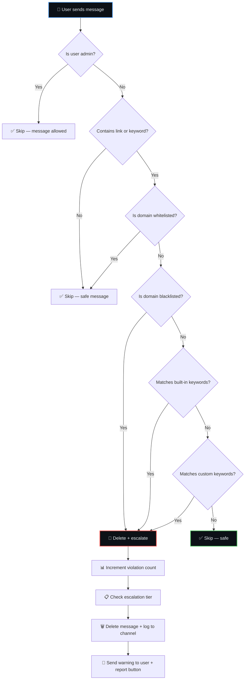
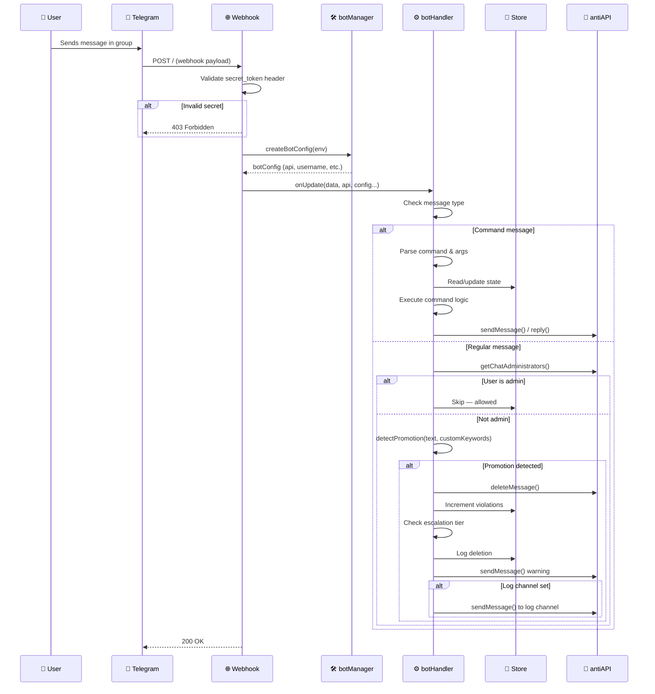

<div align="center">


<br/>

[](https://workers.cloudflare.com)
[](https://vercel.com)
[](https://t.me/AntiPromotionBot)
[](https://opensource.org/licenses/MIT)
[](https://github.com/Shineii86/AntiPromotionBot/releases)

[](https://github.com/Shineii86/AntiPromotionBot/stargazers)
[](https://github.com/Shineii86/AntiPromotionBot/fork)
[](https://github.com/Shineii86/AntiPromotionBot/issues)
[](https://github.com/Shineii86/AntiPromotionBot/commits/main)

<br/>

[🐛 Report Bug](https://github.com/Shineii86/AntiPromotionBot/issues/new) · [💡 Feature Request](https://github.com/Shineii86/AntiPromotionBot/issues/new) · [📝 Changelog](CHANGELOG.md) · [📖 Guide](GUIDE.md)

<br/>

**Tags:** `telegram-bot` `anti-spam` `moderation` `telegram-group` `cloudflare-workers` `serverless` `nodejs` `express` `telegram-api`

</div>

---

## 📑 Table of Contents

<details open>
<summary><b>Quick Navigation</b></summary>

<br/>

| Section | Description |
|:--------|:------------|
| [🤖 What Is Anti-Promotion Bot?](#-what-is-anti-promotion-bot) | Overview & mission |
| [✨ Features](#-features) | Full feature breakdown |
| [🎮 Commands Reference](#-commands-reference) | All commands by access level |
| [⚙️ How It Works](#️-how-it-works) | Detection engine, escalation, and flow |
| [📊 Escalation System](#-escalation-system) | Warning tiers and automatic penalties |
| [🔐 Configuration](#-configuration) | Environment variables explained |
| [🛡️ Security](#️-security) | Webhook validation, permissions, rate limits |
| [🚀 Quick Deploy](#-quick-deploy) | Cloudflare Workers, Vercel, Docker |
| [🏗️ Project Structure](#️-project-structure) | Repository layout |
| [🧠 Architecture](#-architecture) | Request flow and memory model |
| [📡 Webhook Setup](#-webhook-setup) | Setting up webhooks after deploy |
| [🛠️ Development](#️-development) | Local setup and workflow |
| [🤝 Contributing](#-contributing) | How to help |
| [📄 License](#-license) | MIT license |

</details>

---

## 🤖 What Is Anti-Promotion Bot?

> **Хмпф. So you want a clean group? Fine. I'll do it myself.**

Anti-Promotion Bot is a Telegram bot that **automatically detects and removes promotional links and spam** from your groups. It monitors every message, identifies 30+ promotional keywords and URL patterns, and takes action — from silent deletion to escalating warnings and automatic mutes.

Deployed on **Cloudflare Workers** and **Vercel**, it's serverless, zero-maintenance, and costs nothing to run on free tiers.

### 🎯 Key Capabilities

| Capability | Description |
|:-----------|:------------|
| **Link Detection** | Captures promotional URLs (telegram invites, crypto, social media, shopping) |
| **Keyword Filtering** | 30+ built-in promotional keywords + per-group custom keywords |
| **Escalating Warnings** | Warn count resets daily — 1-2=delete, 3-4=strong warning, 5+=auto mute 1hr |
| **Per-Group Config** | Each group has its own whitelist, blacklist, custom keywords, and pause state |
| **Report System** | Members can flag deleted messages to a private admin log channel |
| **Live Statistics** | Messages processed, removals, warnings, uptime, command usage, top spammers |
| **Multi-Platform** | Runs on Cloudflare Workers, Vercel, Docker, or any Node.js server |

---

## ✨ Features

<table>
<tr>
<td width="50%">

### 🛡️ Core Protection
- **Automatic Link Detection** — Detects telegram invites, URLs, crypto addresses, and more
- **30+ Keyword Patterns** — Built-in promotional keyword library, constantly updated
- **Per-Group Whitelist/Blacklist** — Allow or block specific domains per chat
- **Custom Keywords** — Group admins can add their own trigger words via `/keywords`
- **Admin Safe** — Admins are never flagged; their messages bypass all checks
- **Silent Deletion** — Promotional messages are deleted without notifying the sender

</td>
<td width="50%">

### ⚡ Escalation & Moderation
- **Automatic Escalation** — Warn count resets daily, escalates through tiers
- **Auto-Mute** — Users reaching 5+ violations in a day are muted for 1 hour
- **Manual Warn/Mute** — Admins can manually warn or mute users via reply
- **Broadcast** — Bot owner can send announcements to all active groups
- **Log Channel** — All deletions logged to a private channel for admin review
- **Report Button** — Deleted messages include a "report" button for false positives

</td>
</tr>
<tr>
<td>

### 📊 Monitoring & Stats
- **Live `/stats`** — Messages processed, deletions, warnings, mutes, uptime
- **Command Usage** — Track which commands are used most frequently
- **Deletion Log** — Last 20 deletion records with user info and reason
- **Chat Directory** — `/chats` lists all active groups with type indicators
- **Health Endpoint** — `/health` for uptime monitoring

</td>
<td>

### 🚀 Platform & Performance
- **Serverless** — Zero maintenance on Cloudflare Workers or Vercel
- **Free Tier** — Runs entirely on free tiers (Workers, Vercel Hobby)
- **Fast** — sub-100ms detection on edge-deployed Workers
- **Persistent Storage** — File-based (Docker), Upstash Redis (serverless)
- **One-Click Deploy** — Deploy to Workers or Vercel with a single click
- **Graceful Shutdown** — Flushes state on SIGTERM/SIGINT

</td>
</tr>
<tr>
<td>

### 🔧 Per-Group Configuration
- `/pause` / `/resume` — Temporarily disable monitoring in a group
- `/settings` — View current group configuration
- `/whitelist <domain>` — Add trusted domain (bypasses link detection)
- `/blacklist <domain>` — Block specific domain
- `/keywords <word>` — Add custom promotional keywords
- Ownership — All config persists per chat ID across restarts

</td>
<td>

### 📢 Owner Controls
- `/broadcast <message>` — Send announcements to all active groups
- `/chats` — Full directory of all groups the bot has seen
- `/log` — Review the last 20 deletion records
- `/leave` — Remove bot from a problem group remotely
- `/stats` — Global usage statistics

</td>
</tr>
</table>

---

## 🎮 Commands Reference

### 👤 Everyone

| Command | Description | Aliases |
|:--------|:------------|:--------|
| `/start` | Welcome message with inline keyboard | — |
| `/help` | Full command reference with access levels | — |
| `/about` | Bot information, tech stack, and links | — |
| `/donate` | Support the project | — |
| `/status` | Check if bot is properly configured as admin | — |
| `/stats` | Live statistics dashboard | — |

### 👑 Group Admins Only

| Command | Description | Aliases |
|:--------|:------------|:--------|
| `/pause` | Pause monitoring in this chat | — |
| `/resume` | Resume monitoring | — |
| `/settings` | View per-group configuration | — |
| `/whitelist <domain>` | Add trusted domain (bypasses detection) | — |
| `/blacklist <domain>` | Block specific domain | — |
| `/keywords <word>` | Add custom promotional keyword | — |
| `/warn` (reply) | Manually warn a user | — |
| `/mute` (reply) | Mute user for 1 hour | — |

### 🔒 Owner Only

| Command | Description | Aliases |
|:--------|:------------|:--------|
| `/broadcast <msg>` | Send message to all active groups | — |
| `/chats` | List all active chats with types | — |
| `/log` | View last 20 deletion records | — |
| `/leave` | Remove bot from the current group | — |

---

## ⚙️ How It Works

### Detection Flow



### How Detection Works

The `detectPromotion()` function in `api/helper.js` checks messages against multiple criteria:

| Check | What It Detects | Example |
|:------|:----------------|:--------|
| **URL Links** | Any `http://`, `https://`, `t.me/`, `www.` patterns | `https://spam-site.com` |
| **Telegram Invites** | `t.me/joinchat/`, `t.me/+` patterns | `t.me/+abc123` |
| **Built-in Keywords** | 30+ promotional keywords (crypto, free, earn, etc.) | `"earn money fast"` |
| **Custom Keywords** | Per-group keywords set by admins | `"check this out"` |
| **Blacklisted Domains** | Domains explicitly blocked by admins | `spam.com` |
| **Whitelisted Domains** | Domains explicitly allowed (skip all checks) | `github.com` |

---

## 📊 Escalation System

Violations are tracked per-user per-chat, resetting **daily** (UTC midnight).

| Tier | Violations (in 24h) | Action | Warning Message |
|:----:|:-------------------:|:-------|:----------------|
| 1 | 1-2 | 🗑️ Delete only | *"Your message was removed for promotional content."* |
| 2 | 3-4 | 🗑️ Delete + ⚠️ Strong warn | *"You have been warned for repeated promotional messages. Further violations may result in a mute."* |
| 3 | 5+ | 🗑️ Delete + 🔇 Auto-mute (1 hour) | *"You have been muted for 1 hour due to repeated promotional messages."* |

### Reset Behavior

- **Daily reset** — Counter resets to 0 at midnight UTC
- **No persistence** — Violations are ephemeral (reset on restart without Redis)
- **Manual override** — Admins can use `/warn` to increment counter, `/mute` for immediate mute
- **Report button** — Every warning message includes inline keyboard with report option

### Example Flow

```
User posts: "Free crypto here! 🚀 https://spam.xyz"

1. detectPromotion() → matches "crypto" keyword + URL → flag
2. Delete message (silently)
3. Increment violation count for this user: 1
4. Tier 1 → send warning: "Your message was removed for promotional content."
5. Log to log channel (if configured)
6. Report button attached to deletion message

User posts again: "Check out this earn money site!"

1. Keyword match → delete
2. Violation count: 2
3. Tier 1 → delete only (no additional warning if first one is still visible)
```

---

## 🔐 Configuration

### Environment Variables

| Variable | Description | Example | Required |
|:---------|:------------|:--------|:--------:|
| `BOT_TOKEN` | Telegram Bot API token from @BotFather | `123456:ABC-DEF...` | ✅ |
| `BOT_USERNAME` | Bot username (without @) | `AntiPromotionBot` | ✅ |
| `OWNER_ID` | Telegram user ID for owner commands | `123456789` | ❌ |
| `LOG_CHANNEL` | Chat ID for deletion reports | `-100123456789` | ❌ |
| `WEBHOOK_SECRET` | Secret token for webhook validation | `a1b2c3d4...` | ❌ |
| `BOT_PHOTO` | Photo URL for link previews | `https://example.com/pic.jpg` | ❌ |
| `PORT` | Server port for Docker/VPS | `3000` | ❌ |

> **Note:** If `WEBHOOK_SECRET` is not set, a random secret is auto-generated at startup. If `OWNER_ID` is not set, owner-only commands (`/broadcast`, `/chats`, `/log`, `/leave`) are disabled.

### Redis Storage (Optional — for persistent state on serverless)

| Variable | Description | Required |
|:---------|:------------|:--------:|
| `UPSTASH_REDIS_REST_URL` | Upstash Redis REST URL | ❌ |
| `UPSTASH_REDIS_REST_TOKEN` | Upstash Redis REST token | ❌ |

> Sign up free at [console.upstash.com](https://console.upstash.com), create a Redis database, copy the REST URL and token. Without Redis, Docker/Local uses file storage (`data/state.json`). Vercel and Cloudflare Workers fall back to in-memory (resets on cold starts).

### Storage Backend Comparison

| Backend | Docker/Local | Vercel | Cloudflare Workers |
|:--------|:------------:|:------:|:------------------:|
| **Default** | File (`data/state.json`) | In-memory | In-memory |
| **With Redis** | Optional | ✅ Persistent | ✅ Persistent |
| **Cold Start** | Data persists | Resets without Redis | Resets without Redis |

---

## 🛡️ Security

### Webhook Validation

Every incoming webhook request is validated against the `x-telegram-bot-api-secret-token` header. Requests with an invalid or missing secret are rejected with `403 Forbidden`.

```
Request → Check header → Match? → Process update
                        → Mismatch? → 403 Forbidden
```

### Owner-Only Commands

Set `OWNER_ID` to your Telegram user ID (get it from [@userinfobot](https://t.me/userinfobot)). Only that user can access:
- `/broadcast` — Send messages to all groups
- `/chats` — List all active groups
- `/log` — View deletion records
- `/leave` — Remove bot from a group

### Admin Verification

Group admin commands (`/pause`, `/resume`, `/whitelist`, `/blacklist`, `/keywords`, `/warn`, `/mute`) require the user to be a group administrator or creator. The bot verifies this via `getChatAdministrators()` before executing any admin command.

### Rate Limiting

The bot enforces a **30 reactions per minute per chat** limit to prevent Telegram API rate limit errors.

### Request Size Limit

Incoming webhook payloads larger than **1MB** are rejected with `413 Payload Too Large`.

---

## 🚀 Quick Deploy

### ☁️ Cloudflare Workers (Recommended)

[](https://deploy.workers.cloudflare.com/?url=https://github.com/Shineii86/AntiPromotionBot)

**Or manually:**

```bash
git clone https://github.com/Shineii86/AntiPromotionBot.git
cd AntiPromotionBot
npm install
npx wrangler deploy
```

### ▲ Vercel

[](https://vercel.com/new/clone?repository-url=https://github.com/Shineii86/AntiPromotionBot)

```bash
vercel --prod
```

### 🐳 Docker

```bash
git clone https://github.com/Shineii86/AntiPromotionBot.git
cd AntiPromotionBot
cp .env.example .env     # Edit with your config
docker-compose up -d
```

> Data persists across restarts via `./data:/app/data` volume mount.

---

## 🏗️ Project Structure

```
AntiPromotionBot/
├── api/
│   ├── index.js              # Express server (Docker/Vercel/Local)
│   ├── worker.js             # Cloudflare Worker entry point
│   ├── botHandler.js         # Core logic — commands, detection, escalation
│   ├── botManager.js         # Bot config factory (env → API + handler)
│   ├── store.js              # Persistent state storage (file/KV/memory)
│   ├── antiAPI.js            # Telegram API wrapper (all methods)
│   ├── constants.js          # Message templates and keyboard layouts
│   ├── landing.js            # Landing page HTML
│   ├── helper.js             # Utility functions and logger
│   ├── ads.js                # Ad library (sponsored promotions)
│   ├── version.js            # Version source of truth
├── data/                     # Runtime state (auto-created, gitignored)
├── .env.example              # Environment variable template
├── .gitignore
├── package.json              # Dependencies (express, dotenv)
├── wrangler.toml             # Cloudflare Workers config
├── vercel.json               # Vercel config
├── CHANGELOG.md              # Version history
├── LICENSE                   # MIT License
├── GUIDE.md                  # Setup & usage guide
└── README.md                 # This file
```

---

## 🧠 Architecture

### Single Bot Request Flow



### Memory Model

| State | Type | Persistent | Purpose |
|:------|:-----|:----------:|:--------|
| `stats` | Object | ✅ | Messages, deletions, warnings, mutes, uptime |
| `commandUsage` | Object | ✅ | Per-command usage counters |
| `deletionLog` | Array (last 20) | ✅ | Recent deletion records |
| `chats` | Object | ✅ | Chat registry (ID, name, type) |
| `pausedChats` | Array | ✅ | Paused chat IDs |
| `violations` | Object | ❌ | Per-user violation counts (resets daily) |
| `lastBotMessage` | Object | ❌ | Per-chat last bot message ID |
| `rateLimitMap` | Object | ❌ | Per-chat rate limit windows |
| `antispam` | Object | ✅ | Per-group whitelist, blacklist, custom keywords |

---

## 📡 Webhook Setup

After deploying, you need to register the webhook with Telegram.

### Option A — Via Telegram (recommended)

Send this to [@BotFather](https://t.me/BotFather):
```
/setwebhook
```

Or use curl:
```bash
curl -X POST "https://api.telegram.org/bot<BOT_TOKEN>/setWebhook" \
  -H "Content-Type: application/json" \
  -d '{
    "url": "https://your-domain.com/",
    "secret_token": "your_webhook_secret",
    "allowed_updates": ["message", "callback_query"]
  }'
```

### Option B — Via Bot's Own Endpoint

After deploying the Express server:
```bash
curl -X POST "https://your-domain.com/set-webhook" \
  -H "Content-Type: application/json" \
  -d '{"base_url": "https://your-domain.com"}'
```

### Verify Webhook

```bash
curl "https://api.telegram.org/bot<BOT_TOKEN>/getWebhookInfo"
```

Expected response:
```json
{
  "ok": true,
  "result": {
    "url": "https://your-domain.com/",
    "has_custom_certificate": false,
    "pending_update_count": 0,
    "last_error_date": 0,
    "max_connections": 40,
    "allowed_updates": ["message", "callback_query"]
  }
}
```

---

## 🛠️ Development

```bash
# Clone the repository
git clone https://github.com/Shineii86/AntiPromotionBot.git
cd AntiPromotionBot

# Install dependencies
npm install

# Configure environment
cp .env.example .env
# Edit .env with your BOT_TOKEN, BOT_USERNAME, OWNER_ID

# Run locally
npm start

# Or with auto-reload (requires nodemon)
npx nodemon api/index.js
```

### Project Scripts

| Script | Command | Description |
|:-------|:--------|:------------|
| **dev** | `npm start` | Start Express server on port 3000 |
| **vercel** | `npm run vercel` | Start Vercel dev server |
| **worker** | `npm run cloudflare` | Start Wrangler dev server |
| **deploy** | `npx wrangler deploy` | Deploy to Cloudflare Workers |

### Testing the Bot Locally

1. Start the Express server: `npm start`
2. Expose local server with ngrok: `ngrok http 3000`
3. Set webhook: `curl -X POST "https://api.telegram.org/bot<TOKEN>/setWebhook" -H "Content-Type: application/json" -d '{"url": "https://<ngrok-url>/"}'`
4. Send messages to your bot in Telegram

---

## 🤝 Contributing

1. **Fork** the repository
2. **Create** your branch — `git checkout -b feature/amazing-feature`
3. **Commit** — `git commit -m 'Add amazing feature'`
4. **Push** — `git push origin feature/amazing-feature`
5. **Open** a Pull Request

### Ideas for Contributions

- [ ] Whitelist/blacklist wildcard domain patterns (`*.spam.com`)
- [ ] Per-group custom warning messages
- [ ] Temporary unban command
- [ ] Captcha verification for new members
- [ ] Language/locale support
- [ ] Automated test suite
- [ ] Web dashboard for configuration

---

## 📄 License

```
This project is licensed under the MIT License.
Feel free to use, remix, and share it with proper credits.
```

MIT License — see [LICENSE](LICENSE) for details.

---

## 📢 Stay Connected

<p align="center">
  <a href="https://t.me/MaximXBots"></a>
  <a href="https://t.me/MaximXGroup"></a>
  <a href="https://t.me/CodeFlix_Bots"></a>
</p>

---

## 💕 Loved My Work?

🚨 [Follow me on GitHub](https://github.com/Shineii86)

⭐ [Give a star to this Project](https://github.com/Shineii86/AntiPromotionBot)

<a href="https://github.com/Shineii86/AntiPromotionBot">

</a>

## ☎️ Contact

<div align="center">

*For inquiries or collaborations*

[](https://telegram.me/Shineii86 "Contact on Telegram")
[](https://instagram.com/ikx7.a "Follow on Instagram")
[](https://pinterest.com/ikx7a "Follow on Pinterest")
[](mailto:ikx7a@hotmail.com "Send an Email")

<sup><b>Copyright © 2026 <a href="https://telegram.me/Shineii86">Shinei Nouzen</a> All Rights Reserved</b></sup>

</div>
